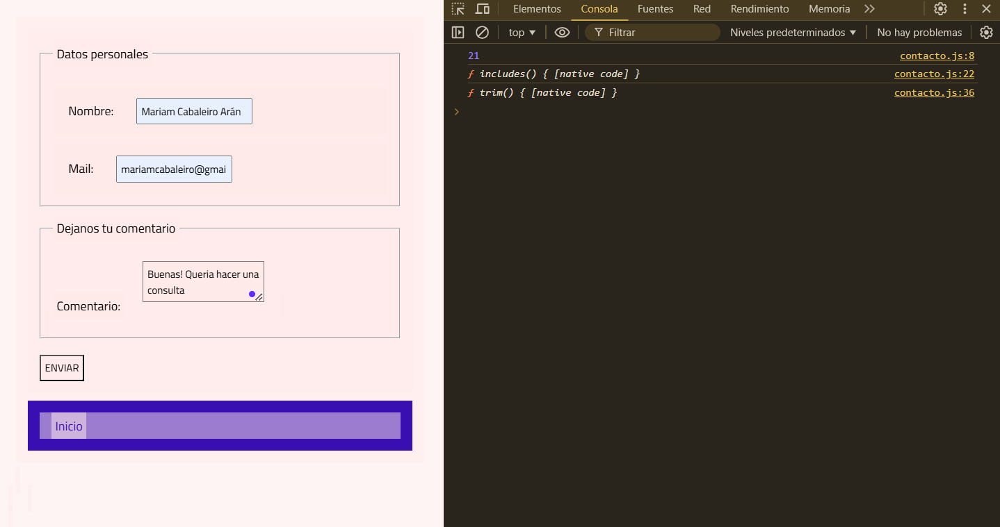

¡Hola Jean Paul!
Mi proyecto es la página de presentación, consulta y venta del empredimiento que tengo de comida congelada vegana.
Algunas aclaraciones: Llegué a lo que llegué, se que es poco, pero no queria dejar de entregar, sentia que era tirar la cursada por la borda. Laburo en gastronomía y Diciembre es un fierno.
-Las imagenes de los productos realmente no se por qué no se ven, consulte en discord, con la IA y no hubi caso.
-En el formulario de contacto no logro deshacerme de una advertencia que me hace la consola, no encunetro el error  
-No llegue a cumplir estas consignas: 
"Implementar un evento click que muestra la descripción ampliada del producto que clickeamos." (No tengo descripción ampliada)
"Los productos en el carrito se deben poder...eliminar." (No llegué a codificar para que se eliminen)
"Reemplazar el nav creado anteriormente por el navbar responsivo creado con Bootstrap." (Funciona pero lo deje como en la pre-entrega)

Muchas gracias por tu trabajo y disculpas por llegar en este estado. Soy nueva en programación, es mi primer curso, espero ir avanzando un poco mas.

Fue un gusto.
Saludos
Mariam